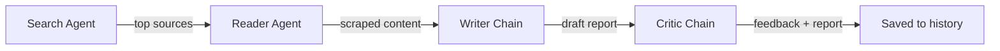

# ⚡ NexusResearch-AI

A multi-agent AI research pipeline that takes a topic, researches it end-to-end, and returns a fact-checked report — with a live Streamlit dashboard to watch the agents work.

> Search → Read → Write → Critique — four agents, one pipeline.

---

## How it works



| Stage | Agent | Job |
|---|---|---|
| 01 | **Search Agent** | Finds recent, reliable sources on the topic |
| 02 | **Reader Agent** | Picks the strongest source and scrapes it for depth |
| 03 | **Writer Chain** | Drafts the full research report from everything gathered |
| 04 | **Critic Chain** | Reviews the report and returns feedback / a quality check |

The final report, critic feedback, and raw intermediate results are saved to history and viewable in the UI.

---

## Features

- 🧠 Four specialized agents chained into a single research pipeline
- 🖥️ Streamlit dashboard with a **live status board** — each stage flips `WAITING → RUNNING → DONE` as it actually executes
- 📄 Downloadable Markdown report
- 💾 Automatic history logging of every research run
- ⌨️ Also runnable straight from the terminal, no UI required

---

## Project structure

```
research_agent/
├── .env                # API keys / secrets (not committed)
├── requirement.txt     # Python dependencies
├── tools.py            # Search / scraping tools used by the agents
├── agents.py           # Agent + chain definitions (search, reader, writer, critic)
├── pipeline.py         # CLI entry point — runs the full pipeline in the terminal
├── app.py              # Streamlit UI — runs the pipeline with a live dashboard
└── history.py          # Saves each research run for later reference
```

---

## Getting started

### 1. Clone the repo

```bash
git clone https://github.com/<your-username>/<your-repo>.git
cd research_agent
```

### 2. Create a virtual environment

```bash
python -m venv .venv
source .venv/bin/activate      # Windows: .venv\Scripts\activate
```

### 3. Install dependencies

```bash
pip install -r requirement.txt
```

### 4. Set up environment variables

Create a `.env` file in the project root:

```env
# Replace with whatever keys your agents.py / tools.py actually require
OPENAI_API_KEY=your_key_here
# e.g. TAVILY_API_KEY=your_key_here
```

> ⚠️ **Note:** I don't have visibility into your `tools.py` / `agents.py`, so the exact variable names above are placeholders — swap them for whatever keys your code actually reads.

---

## Usage

### Run in the terminal

```bash
python pipeline.py
```

You'll be prompted for a topic, then see each stage's output printed live.

### Run the Streamlit dashboard

```bash
streamlit run app.py
```

Enter a topic (or click one of the example chips), hit **Run Research Pipeline**, and watch the four stages complete in real time. Once finished, the report, critic feedback, and raw search/scrape data are available in tabs, with a one-click Markdown download.

---

## Roadmap

- [ ] Streaming token-by-token report generation in the UI
- [ ] Support for multiple source URLs in the Reader stage
- [ ] Export report as PDF
- [ ] Research history browser in the UI

---

## License

MIT — feel free to fork and adapt.
